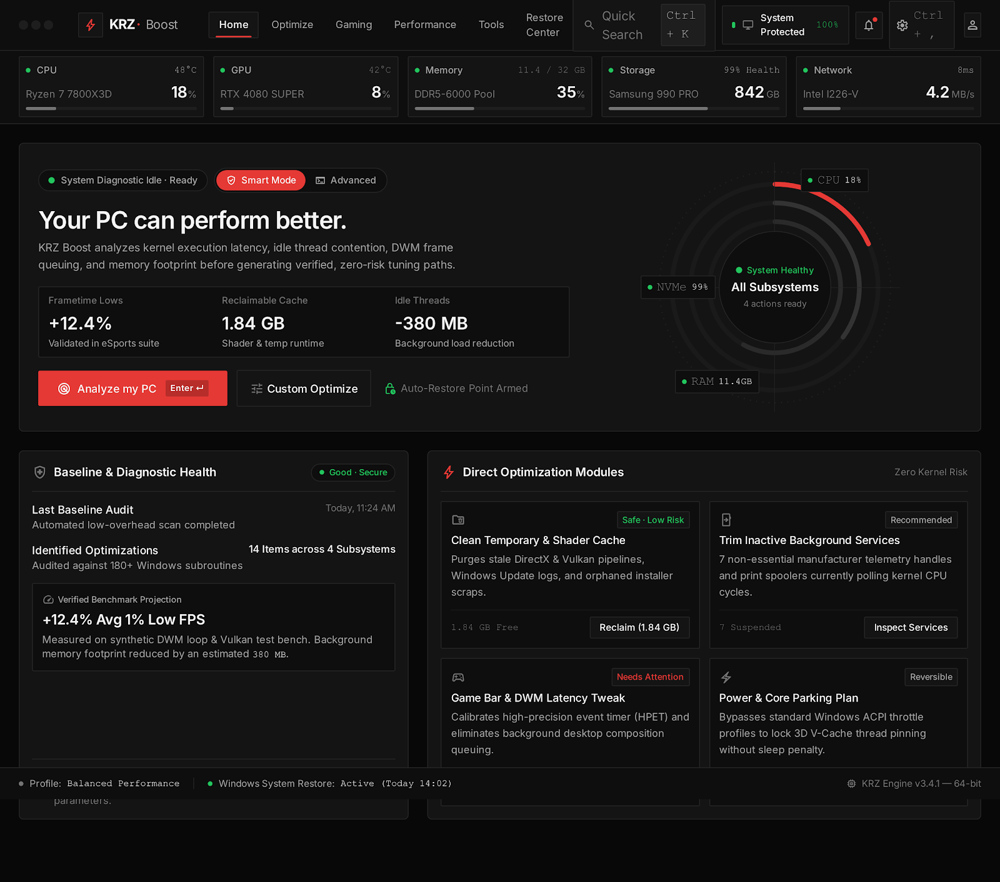
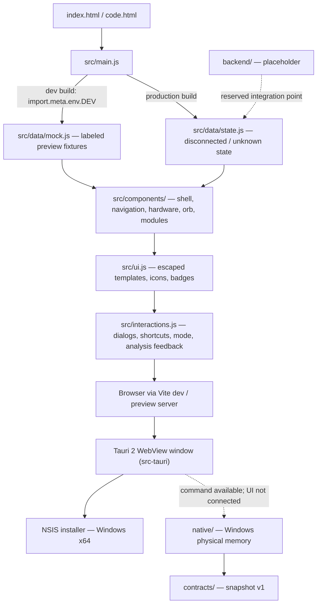

<h1 align="center">KRZ Boost</h1>

<p align="center">
  <strong>Dark, accessible Windows performance dashboard — polished frontend and desktop shell, honest about what is not built yet.</strong>
</p>

<p align="center">
  <a href="https://github.com/brielmarca/projeto-knr/actions/workflows/windows-desktop-build.yml"></a>
  
  
  
  
</p>

<p align="center">
  <a href="#overview">Overview</a> ·
  <a href="#demonstration">Demonstration</a> ·
  <a href="#features">Features</a> ·
  <a href="#technology-stack">Stack</a> ·
  <a href="#architecture">Architecture</a> ·
  <a href="#development-setup">Development</a> ·
  <a href="#windows--tauri-build">Windows build</a> ·
  <a href="#project-status">Status</a> ·
  <a href="#roadmap--current-priorities">Roadmap</a>
</p>

---

## Overview

KRZ Boost is a desktop-first dashboard UI for reviewing Windows performance work: hardware overview, diagnostic baseline, and a grid of optimization modules. This repository contains two working pieces:

- **A production frontend** — vanilla JavaScript ES modules, compiled Tailwind 3, built with Vite. `screen.png` and the current product brief are the visual authority; the implementation follows them closely.
- **A Tauri 2 desktop shell** — the same frontend packaged into a native Windows window and NSIS installer, with a read-only memory IPC command that the UI does not invoke yet.

Everything is designed around one rule: **missing data stays missing**. Without a Windows engine, hardware metrics, findings, benchmarks, and restore status render as unavailable/unknown, and applying changes stays disabled.

> **Integration status:** `native/` collects physical memory on Windows, and `contracts/` defines the v1 snapshot. There is no Windows Agent, PowerShell or shell execution, API client, backend, PostgreSQL, or optimization/restore-point logic. `backend/` remains a placeholder. `VITE_API_URL` is reserved for a future integration; see `.env.example`.

---

## Demonstration

<p align="center">
  
</p>
<p align="center"><sub>Approved <code>screen.png</code> design reference — the visual authority the implementation reproduces.</sub></p>

The live app renders the same layout with honest data states:

| Run mode                             | What you see                                                                                           |
| ------------------------------------ | ------------------------------------------------------------------------------------------------------ |
| `npm run dev` (development)          | Fixtures from the Stitch design, always labeled **"Development preview · Mock data"**                  |
| `npm run preview` (production build) | Disconnected/unknown values — "Windows telemetry · Not connected", "Analysis required", "Not verified" |

`npm run test:e2e` writes full-page screenshots at 1440×900, 1920×1080, 1366×768 and 1280×720 to `test-results/` (git-ignored, regenerated per run).

---

## Features

**Implemented**

- [x] Dashboard shell matching the approved design: hardware strip, hero panel with concentric system orb, baseline card, optimization module grid
- [x] Strict separation of mock and real data — mock fixtures are loaded only behind Vite's compile-time `DEV` branch and are excluded from production bundles
- [x] Disconnected production telemetry: no invented measurements, health scores, benchmarks, or restore guarantees
- [x] Disabled-by-default "Apply optimization" actions with explicit reasons until a Windows integration exists
- [x] Module search dialog (Ctrl/Cmd+K) with live filtering, empty state, focus management, and escaped dynamic content
- [x] Settings dialog (Ctrl/Cmd+,) plus system, notifications, and profile dialogs using native `<dialog>`
- [x] Smart / Advanced mode switch as a session preference with `aria-pressed` state
- [x] Real in-page navigation anchors for Home, Optimize, Gaming, Performance, Tools, Restore Center
- [x] Accessible by default: skip link, landmarks, `aria-live` analysis feedback, focus restore after Escape, keyboard-operable dialogs
- [x] Desktop layouts verified at 1440×900, 1920×1080, 1366×768 and 1280×720 with zero automated axe violations
- [x] Reduced-motion and forced-colors stylesheets
- [x] Shared design tokens (`src/tokens.css`) and reusable Card/Button/Badge/Status styles (`src/styles.css`)
- [x] Tauri 2 desktop shell: one local-main-window memory capability, no global Tauri API, restrictive CSP, current-user NSIS install
- [x] Read-only Rust physical-memory collector and typed IPC command; explicit unsupported-platform errors on Linux; no frontend integration yet
- [x] Windows x64 CI workflow producing installer and executable artifacts
- [x] Quality gate: formatting, ESLint, strict JSDoc typechecking, Node tests, production build, browser tests

**Not implemented yet**

- [ ] Frontend telemetry integration / Agent (broader hardware, diagnostics, restore verification)
- [ ] Backend service and API client (`VITE_API_URL` is reserved and unused)
- [ ] PostgreSQL persistence (`backend/` is a placeholder)
- [ ] Applying optimizations, system changes, and restore-point creation or verification
- [ ] Production icon artwork (current icon reuses the KRZ bolt mark)
- [ ] Manual Windows screen-reader and native-shell testing
- [ ] A published `LICENSE` file

---

## Technology stack

| Category          | Choices                                                                                                                          |
| ----------------- | -------------------------------------------------------------------------------------------------------------------------------- |
| **Language**      | Vanilla JavaScript ES modules — no UI framework; Vite is build tooling only                                                      |
| **Types**         | TypeScript 5.9 in strict mode via JSDoc annotations (`tsc --noEmit`, `checkJs`)                                                  |
| **Styling**       | Tailwind CSS 3 compiled locally through PostCSS + Autoprefixer, custom tokens in `src/tokens.css`, Inter via `@fontsource/inter` |
| **Build**         | Vite 7 (two HTML entries: `index.html`, `code.html`)                                                                             |
| **Desktop**       | Tauri 2 (Rust ≥ 1.77.2), NSIS bundling, `src-tauri/`                                                                             |
| **Testing**       | Playwright + `@axe-core/playwright` browser tests, `node --test` unit tests                                                      |
| **Lint / format** | ESLint 9 (flat config), Prettier 3                                                                                               |
| **CI**            | GitHub Actions on `windows-latest` (`.github/workflows/windows-desktop-build.yml`)                                               |

---

## Architecture



Key rules encoded in the code:

- `src/data/state.js` is the single typed source of disconnected state. Real telemetry belongs here once its source and schema exist; fixtures must never substitute for missing data.
- `src/data/mock.js` is development-only. Vite's compile-time `DEV` branch keeps it out of production, and browser tests assert that production never displays sample telemetry even with a `?mock=true` query parameter.
- Dynamic text is escaped through `src/ui.js` before interpolation into trusted templates.
- The Tauri shell grants only `collect_system_snapshot` to the local `main` window, keeps `withGlobalTauri: false`, and allows IPC through its CSP. Remote origins and other windows cannot invoke the collector.

### Repository layout

- `src/tokens.css` — neutral/red/green palette, spacing, radii, motion, contrast-tuned muted text and button red
- `src/styles.css` — shared Card, Button, Badge, StatusIndicator and desktop layout styles
- `src/components/` — app shell, navigation, hardware metrics, original concentric system orb, optimization cards
- `src/interactions.js` — mode selection, local module search, native dialogs, keyboard shortcuts, explicit analysis feedback
- `src/data/` — typed disconnected state and development-only screenshot fixtures
- `src-tauri/` — Tauri 2 configuration, Rust entry point, icons
- `native/` — read-only Windows memory collector; unsupported elsewhere
- `contracts/` — standalone v1 memory schema and contract tests
- `tests/` — Node unit tests and Playwright browser tests (keyboard, search, dialogs, mock isolation, layouts, axe)
- `DESIGN.md` — legacy reference; contains superseded colors, glass treatments, and navigation guidance

---

## Development setup

**Requirements:** Node.js 22.12+ (verified with Node.js 24).

```sh
npm ci
npm run dev
```

Open the local URL Vite prints (bound to `127.0.0.1:5173`, matching Tauri's `devUrl`). Both `/` and `/code.html` load the dashboard.

```sh
npm run build     # production bundle (disconnected telemetry)
npm run preview   # serve the production bundle
```

### Verification

```sh
npm run format            # Prettier write (src, tests, config, index.html)
npm run check             # format:check + lint + typecheck + node tests + build
npx playwright install chromium
npm run test:e2e          # browser tests against dev and preview servers
```

Browser tests cover mock isolation, keyboard and search/dialog behavior, disconnected error states, and desktop layouts at the four supported sizes, running axe checks and saving full-page screenshots under `test-results/`.

Automated accessibility checks do not replace manual Windows screen-reader and native-shell testing.

---

## Windows & Tauri build

The existing Vite frontend is packaged as a Tauri 2 desktop application. The shell exposes a read-only native memory command, while the UI remains disconnected. See [the IPC reference and checks](src-tauri/README.md). No Agent, PowerShell, backend, PostgreSQL, or optimization engine is bundled.

```sh
npm run desktop:dev    # starts Vite and opens a native desktop window
npm run desktop:build  # builds an NSIS installer (Windows)
```

- `desktop:dev` requires Rust and the platform-specific Tauri development prerequisites.
- `desktop:build` creates an NSIS installer with `currentUser` install mode; Windows x64 artifacts (installer + `krz-boost.exe`) are also produced by `.github/workflows/windows-desktop-build.yml` on `windows-latest`.
- **Configuration:** `VITE_API_URL` is compile-time, public configuration set in the build environment (see `.env.example`). No API client exists yet, so the variable does not change current unavailable behavior; it is never hardcoded into Tauri and never holds secrets. The sole Tauri capability permits read-only memory collection from the local main window.
- **Window:** 1280×800 default, 1000×650 minimum, centered and resizable.
- **Icon:** temporary reuse of the KRZ bolt mark; final production artwork is pending.

A web build or Linux check does not prove Windows installer or native behavior — verify on Windows or through the workflow.

---

## Project status

| Area                                                                 | State                                             |
| -------------------------------------------------------------------- | ------------------------------------------------- |
| Dashboard UI vs. approved design                                     | Implemented and browser-tested                    |
| Honest disconnected/mock data behavior                               | Implemented and asserted by tests                 |
| Accessibility (automated axe, keyboard, reduced motion)              | Implemented; manual Windows testing still pending |
| Web packaging (Vite production build)                                | Working                                           |
| Windows desktop shell (Tauri 2 + NSIS)                               | Working shell; CI workflow in place               |
| Native memory collector + IPC | Implemented; UI integration pending |
| Windows Agent / backend / database / optimization engine | **Not started** — placeholders only |

The product is a truthful, accessible UI foundation. It deliberately refuses to simulate scans, findings, performance gains, restore points, or optimizations as real operations.

---

## Roadmap / current priorities

Ordered priorities, not committed dates:

1. **Define real interfaces first** — establish contracts before wiring any integration, keeping privileged operations out of frontend code.
2. **Telemetry source** — connect a Windows data source into `src/data/state.js` with a verified schema, preserving unavailable/unknown semantics for missing values.
3. **Backend + persistence** — implement the API behind the reserved `VITE_API_URL` and populate the `backend/` placeholder, extending contracts as needed.
4. **Authorized system operations** — only with explicit authorization and verified results; never promise restoration without evidence.
5. **Desktop polish** — final icon artwork, Windows manual accessibility testing, installer verification.

---

## License & contact

No `LICENSE` file has been published yet; until one is added, all rights are reserved by the author.

Questions, feedback, or bug reports: open an issue at [github.com/brielmarca/projeto-knr/issues](https://github.com/brielmarca/projeto-knr/issues).
