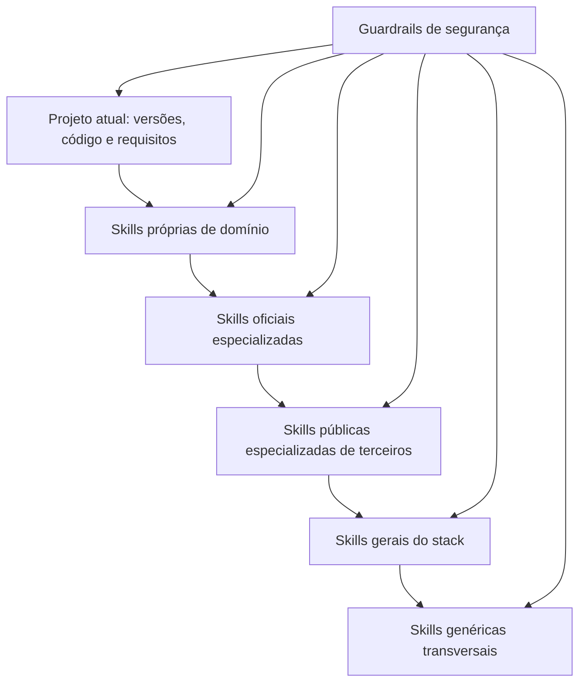

# Auditoria aprofundada das skills do OpenCode e próximos passos

## Resumo executivo

O conjunto atual de **19 skills globais do OpenCode está bem montado e deve ser preservado**. Ele cobre com boa separação de responsabilidades a maior parte do seu fluxo profissional: Java/Spring Boot, desenho de APIs, PostgreSQL, migrações em nível arquitetural, React/Vite, testes, segurança genérica, Docker, GitHub Actions, CI/CD, observabilidade, acessibilidade, debugging e documentação. As sobreposições existentes são, em geral, complementares e não redundantes.

A auditoria anterior feita no seu ambiente concluiu que nenhuma das lacunas restantes possuía uma skill pública completa o suficiente e propôs oito skills próprias. fileciteturn0file0 A pesquisa independente atualizada para **9 de setembro de 2026** confirma a maior parte dessa conclusão, mas muda duas decisões importantes:

| Lacuna | Decisão recomendada | Resultado |
|---|---|---|
| Spring Security / JWT RS256 | **CREATE OWN SKILL** | Duas skills próprias, separando baseline de segurança HTTP de OAuth2/JWT |
| Flyway | **CREATE OWN SKILL** | Skill própria pequena, operacional e fortemente protegida contra `clean`, `repair`, baseline e drift |
| MapStruct | **CREATE OWN SKILL** | Skill própria, com `ReportingPolicy.ERROR` e regras explícitas para DTO/JPA |
| Hibernate / JPA avançado | **CREATE OWN SKILL** | Skill própria focada em fetch plans, N+1, transações, locking, batching e Hibernate 6/7 |
| Redis tradicional | **INSTALL EXISTING SKILL** | Instalar `redis-core`, `redis-connections` e `redis-security` do repositório **oficial da Redis** |
| Nginx | **CREATE OWN SKILL** | Skill própria, version-aware e com `nginx -t → diff → confirmação → reload` |
| OpenAPI / Swagger | **INSTALL EXISTING SKILL** | Instalar `wshobson/agents@openapi-spec-generation` e complementá-la com regras Spring/springdoc nas suas próprias instruções |
| MapStruct repetido no pedido | Mesma decisão acima | Não criar uma segunda skill |

A principal descoberta nova é o amadurecimento do repositório oficial `redis/agent-skills`. Ele é mantido pela organização Redis, tinha **144 estrelas e atividade em 8 de setembro de 2026** no momento desta auditoria, e o índice do Skills mostrava cerca de **17,3 mil instalações agregadas** entre suas 12 skills. fileciteturn11file0L2-L2 fileciteturn12file0L2-L2 citeturn21search1 As três skills relevantes ao seu uso tradicional de Redis — `redis-core`, `redis-connections` e `redis-security` — são suficientemente focadas para substituir a ideia anterior de criar uma skill Redis inteiramente do zero. citeturn21search3turn21search4turn21search5

A segunda exceção é OpenAPI. `wshobson/agents@openapi-spec-generation` tem cobertura realmente forte de **OpenAPI 3.1, design-first/code-first, reusable components, security schemes, Spectral/Redocly e SDK generation**, com cerca de **14,5 mil instalações**; o repositório tinha aproximadamente **39,5 mil estrelas** na coleta. citeturn21search0 fileciteturn8file0L2-L2 Ela não resolve springdoc por si só, mas a separação é saudável: a skill pública cuida do **contrato OpenAPI** e as convenções Spring verificam a versão real do Boot/springdoc. A matriz oficial atual do springdoc distingue claramente Spring Boot 3 e 4; por exemplo, Boot 4 usa a linha springdoc 3.x, enquanto Boot 3 usa 2.x, com compatibilidade mais específica por minor. citeturn23search0turn23search2turn23search5

Minha configuração-alvo, portanto, seria de **29 skills globais**, caso todas as recomendações abaixo sejam implementadas: as 19 atuais, quatro novas skills públicas e seis skills próprias. Isso ainda é administrável porque as seis próprias terão escopos estreitos e regras claras de ativação. O ponto mais importante não é o número bruto, mas impedir que duas skills tentem ser a autoridade sobre o mesmo domínio.

## Estado atual e aderência das 19 skills

O inventário fornecido mostra que as 18 novas skills foram instaladas globalmente apenas para OpenCode, somando-se à `find-skills`, e que você validou o resultado tanto em formato humano quanto JSON. Essa é uma boa baseline para qualquer mudança futura:

```bash
npx skills list -g -a opencode
npx skills list -g -a opencode --json
```

### Avaliação individual

| Skill atual | Aderência ao seu stack | Avaliação | Papel recomendado daqui para frente |
|---|---|---|---|
| `find-skills` | Transversal | **Excelente** | Descoberta de candidatos; nunca deve equivaler a confiança automática |
| `java-springboot` | Java 21, Boot 3/4, REST, JPA | **Excelente como baseline** | Continua sendo a skill Java geral; especialistas devem vencê-la em Security/JPA/Flyway |
| `api-and-interface-design` | REST APIs | **Excelente** | Autoridade sobre semântica HTTP, contratos, erros, paginação e idempotência |
| `postgresql-table-design` | PostgreSQL | **Excelente** | Autoridade sobre schema, constraints, tipos, índices e modelagem |
| `postgresql-optimization` | PostgreSQL | **Excelente** | Autoridade sobre SQL, planos, `EXPLAIN`, índices e tuning |
| `database-migrations` | Flyway / evolução de schema | **Excelente, mas abstrata** | Estratégia expand-contract/backfills; não deve decidir detalhes específicos de Flyway |
| `vercel-react-best-practices` | React 19 | **Excelente** | Performance e padrões React; manter |
| `vite` | Vite | **Excelente com version check** | Build/plugins/HMR; deve detectar a versão real antes de sugerir configuração |
| `vitest` | Vitest | **Excelente com version check** | Unit/integration frontend |
| `playwright-best-practices` | Playwright | **Excelente** | E2E, locators, fixtures, estabilidade |
| `accessibility` | WCAG/ARIA/frontend | **Excelente** | Autoridade de acessibilidade |
| `code-review-and-quality` | Todo o stack | **Excelente** | Inspeção e classificação de defeitos |
| `systematic-debugging` | Todo o stack | **Excelente com ressalva** | Método de investigação; não tratar a metodologia como dogma |
| `code-security` | AppSec | **Excelente como camada genérica** | OWASP e revisão ampla; especialistas devem vencer em Spring/Redis/Nginx |
| `multi-stage-dockerfile` | Docker | **Excelente** | Construção de imagens; não deve governar Docker Compose ou deployment |
| `github-actions-hardening` | GitHub Actions | **Excelente** | Workflow permissions, secrets e supply chain |
| `deployment-pipeline-design` | CI/CD | **Excelente** | Promoção, rollback, canary/blue-green |
| `observability-and-instrumentation` | produção | **Excelente** | Logs/métricas/traces/alertas; evitar duplicá-la com skills específicas sem necessidade |
| `documentation-writer` | documentação técnica | **Excelente** | Documentação humana; OpenAPI deve cuidar do contrato executável |

A arquitetura atual já apresenta uma característica desejável: **as especializações são ortogonais**. `postgresql-table-design` decide como estruturar o banco, enquanto `postgresql-optimization` investiga comportamento real das queries; `vitest` e Playwright têm níveis de teste diferentes; `github-actions-hardening` governa segurança do workflow, enquanto `deployment-pipeline-design` governa a estratégia de entrega.

A mesma regra deve orientar as novas skills.

Há algumas áreas do seu stack que continuam parcialmente cobertas, mas não justificam uma nova skill global neste momento:

**Caffeine** pode permanecer dentro do contexto Java/Spring Cache. Uma skill inteira só para Caffeine provavelmente teria baixo retorno.

**Tailwind v4** continua parcialmente descoberto. A candidata `tailwind-design-system` pode ser útil em projetos que realmente adotam um design system formal, mas instalá-la globalmente pode fazer o agente introduzir CVA, variantes e abstrações em projetos que não precisam delas. Eu a manteria opcional.

**Docker Compose** também permanece parcialmente descoberto. A skill de Dockerfile não cobre Compose, mas a opção anteriormente encontrada continha exemplos potencialmente destrutivos como remoção de volumes/imagens; isso é exatamente o tipo de operação que uma skill global não deve normalizar. A ausência de uma skill é melhor do que uma skill perigosa.

### O modelo de cobertura ideal

```mermaid
flowchart TD
    A[OpenCode]

    A --> B[Backend]
    A --> C[Frontend]
    A --> D[Data]
    A --> E[Infra & Delivery]
    A --> F[Qualidade & Segurança]

    B --> B1[java-springboot]
    B --> B2[Spring Security própria]
    B --> B3[OAuth2 JWT própria]
    B --> B4[JPA Hibernate própria]
    B --> B5[MapStruct própria]

    C --> C1[React best practices]
    C --> C2[Vite]
    C --> C3[Vitest]
    C --> C4[Playwright]
    C --> C5[Accessibility]

    D --> D1[PostgreSQL table design]
    D --> D2[PostgreSQL optimization]
    D --> D3[database-migrations]
    D --> D4[Flyway própria]
    D --> D5[Redis official skills]

    E --> E1[Dockerfile]
    E --> E2[GitHub Actions]
    E --> E3[Deployment pipeline]
    E --> E4[Observability]
    E --> E5[Nginx própria]

    F --> F1[code-security]
    F --> F2[code-review]
    F --> F3[systematic-debugging]
    F --> F4[OpenAPI]
    F --> F5[documentation-writer]
```



Esse desenho evita tentar criar uma “super skill Spring” que governe simultaneamente autenticação, ORM, migrations, cache e OpenAPI. Skills menores reduzem ativação acidental e tornam conflitos muito mais previsíveis.

## Pesquisa de candidatos públicos

A pesquisa priorizou projetos oficiais ou de organizações, seguida de repositórios com adoção e atividade reais. Um resultado importante é que **popularidade do repositório não equivale a qualidade da skill específica**. O exemplo extremo é `affaan-m/ECC`: o repositório tinha mais de 250 mil estrelas na coleta e é extremamente ativo, mas a skill `springboot-security` permite tanto `OncePerRequestFilter` quanto Resource Server para JWT. fileciteturn5file0L2-L2 citeturn21search8 Para o seu padrão, que deseja Resource Server moderno sempre que ele resolve o problema, essa flexibilidade excessiva é uma desvantagem.

Também é importante destacar que o ecossistema mudou rapidamente em 2026. Por exemplo, `rrezartprebreza/spring-boot-skills` foi criado em abril de 2026, tinha **260 estrelas** em setembro e recebeu em 7 de setembro um commit especificamente voltado a melhorar a qualidade e verificação comportamental das skills. fileciteturn2file0L2-L2 fileciteturn7file0L2-L2 Portanto, candidatos que eram imaturos alguns meses antes podem já merecer nova inspeção.

### Candidatos relevantes

As métricas abaixo são um snapshot de setembro de 2026; repositórios e skills devem ser reavaliados imediatamente antes de instalar.

| Skill | Source (URL) | Objective | Popularidade / métricas | Por que seria útil para você | Prioridade | Install command |
|---|---|---|---|---|---|---|
| `springboot-security` | [affaan-m/ECC](https://github.com/affaan-m/ECC) | Segurança Spring, JWT, CORS/CSRF, rate limit | ~2,8K installs; repo 254.853★ e atividade em 09/09/2026. citeturn21search8 fileciteturn5file0L2-L2 | Cobertura ampla de Spring Security | **Não instalar**: permite JWT via filtro artesanal e é genérica demais para seu baseline | `npx skills add affaan-m/ECC --skill springboot-security -g -a opencode -y` |
| `spring-boot-security-jwt` | [giuseppe-trisciuoglio/developer-kit](https://github.com/giuseppe-trisciuoglio/developer-kit) | JWT, refresh, RBAC/ABAC em Boot 3.5 | ~2,9K installs; repo 343★; último commit 18/08/2026. citeturn21search10 fileciteturn6file0L2-L2 fileciteturn10file0L2-L2 | Tem refresh rotation e autorização bem mais profundas | **Média / referência**: Boot 3.5 + JJWT, enquanto seu padrão deve privilegiar Resource Server e Boot 3/4 | `npx skills add giuseppe-trisciuoglio/developer-kit --skill spring-boot-security-jwt -g -a opencode -y` |
| `oauth2-resource-server` / security skills | [rrezartprebreza/spring-boot-skills](https://github.com/rrezartprebreza/spring-boot-skills) | Resource Server e práticas Spring Boot | 260★; último commit 07/09/2026. fileciteturn2file0L2-L2 fileciteturn7file0L2-L2 | Uma das alternativas mais alinhadas ao moderno Spring Security | **Alta como fonte, não global**: possui variantes Boot 3/4 e exige atenção a nomes/versionamento | `npx skills add rrezartprebreza/spring-boot-skills --skill oauth2-resource-server -g -a opencode -y` |
| `spring-security-configuration` | [Amplicode/spring-skills](https://github.com/Amplicode/spring-skills) | Configuração Spring Security | 112★; último commit 06/09/2026. fileciteturn13file0L2-L2 fileciteturn14file0L2-L2 | Conteúdo Spring especializado | **Baixa**: dependência/ecossistema Amplicode/MCP reduz portabilidade | `npx skills add Amplicode/spring-skills --skill spring-security-configuration -g -a opencode -y` |
| `flyway-migrations` | [rrezartprebreza/spring-boot-skills](https://github.com/rrezartprebreza/spring-boot-skills) | Flyway em Spring Boot | 260★; último commit 07/09/2026. fileciteturn2file0L2-L2 fileciteturn7file0L2-L2 | Melhor base pública encontrada para implementação Spring/Flyway | **Alta como referência**; own skill ainda é preferível devido aos gates de produção | `npx skills add rrezartprebreza/spring-boot-skills --skill flyway-migrations -g -a opencode -y` |
| `313-frameworks-spring-db-migrations-flyway` | [jabrena/plinth](https://github.com/jabrena/plinth) | Spring + Flyway, migrations e configuração | 438★; atividade/commit em 09/09/2026. fileciteturn15file0L2-L2 fileciteturn16file0L2-L2 | Projeto Java bastante ativo e conteúdo útil como referência | **Média**: não substitui um baseline rigoroso para operações perigosas | `npx skills add jabrena/plinth --skill 313-frameworks-spring-db-migrations-flyway -g -a opencode -y` |
| `mapper-creator` | [Amplicode/spring-skills](https://github.com/Amplicode/spring-skills) | Criação de mappers, incluindo MapStruct | 112★; último commit 06/09/2026. fileciteturn13file0L2-L2 fileciteturn14file0L2-L2 | Mais interessante que uma skill MapStruct superficial | **Baixa**: dependência de fluxo Amplicode e escopo maior que MapStruct | `npx skills add Amplicode/spring-skills --skill mapper-creator -g -a opencode -y` |
| `jpa-patterns` | [affaan-m/ECC](https://github.com/affaan-m/ECC) | JPA/Hibernate, fetch, queries, batching | Repo 254.853★; ativo em 09/09/2026. fileciteturn5file0L2-L2 | Boa amplitude e exemplos práticos | **Média / referência**: contém prescrições genéricas demais para produção |
| `spring-data-jpa` | [rrezartprebreza/spring-boot-skills](https://github.com/rrezartprebreza/spring-boot-skills) | Spring Data JPA para gerações recentes do Boot | 260★; último commit 07/09/2026. fileciteturn2file0L2-L2 fileciteturn7file0L2-L2 | Boa fonte para diferenças Boot/Hibernate | **Alta como referência**, mas não como única skill global Boot 3/4 | `npx skills add rrezartprebreza/spring-boot-skills --skill spring-data-jpa -g -a opencode -y` |
| `redis-core` | [redis/agent-skills](https://github.com/redis/agent-skills) | Modelagem, estruturas e convenções de keys | ~2,8K installs; repo oficial 144★; commit 08/09/2026. citeturn21search4 fileciteturn11file0L2-L2 fileciteturn12file0L2-L2 | Cobre cache, sessões, counters e estruturas Redis sem ruído de LLM | **Instalar** | `npx skills add redis/agent-skills --skill redis-core -g -a opencode -y` |
| `redis-connections` | [redis/agent-skills](https://github.com/redis/agent-skills) | Connections, pooling/multiplexing, batching, SCAN, timeouts | ~2,0K installs; repo oficial 144★; commit 08/09/2026. citeturn21search5 fileciteturn11file0L2-L2 | Cita explicitamente clientes como Lettuce e Jedis, portanto conversa diretamente com Spring Data Redis | **Instalar** | `npx skills add redis/agent-skills --skill redis-connections -g -a opencode -y` |
| `redis-security` | [redis/agent-skills](https://github.com/redis/agent-skills) | TLS, autenticação, ACL e exposição de rede | ~1,6–1,7K installs; repo oficial 144★; commit 08/09/2026. citeturn21search1turn21search3 fileciteturn12file0L2-L2 | Preenche justamente a parte de segurança que skills genéricas de caching costumam ignorar | **Instalar** | `npx skills add redis/agent-skills --skill redis-security -g -a opencode -y` |
| `reverse-proxy` | [bagelhole/devops-security-agent-skills](https://github.com/bagelhole/devops-security-agent-skills) | Reverse proxy, TLS, headers, WebSocket e rate limit | ~939★ no índice observado anteriormente; último commit precisa ser reconfirmado antes de qualquer instalação | Cobertura funcional próxima do que você precisa | **Não instalar**: riscos de configuração/versionamento e trust de headers justificam own skill | `npx skills add bagelhole/devops-security-agent-skills --skill reverse-proxy -g -a opencode -y` |
| `openapi-spec-generation` | [wshobson/agents](https://github.com/wshobson/agents) | OpenAPI 3.1, lint, schemas, security, SDKs | ~14,5K installs; 39.523★ no repo; último commit surfaced no branch padrão em 01/09/2026. citeturn21search0 fileciteturn8file0L2-L2 fileciteturn9file0L2-L2 | Excelente contrato genérico, complementa `api-and-interface-design` | **Instalar** | `npx skills add wshobson/agents --skill openapi-spec-generation -g -a opencode -y` |
| `spring-boot-openapi-documentation` | [giuseppe-trisciuoglio/developer-kit](https://github.com/giuseppe-trisciuoglio/developer-kit) | springdoc/OpenAPI em Spring Boot | Repo 343★; último commit 18/08/2026. fileciteturn6file0L2-L2 fileciteturn10file0L2-L2 | Dá o complemento Spring que a skill genérica não tem | **Opcional, não instalar agora**: aumentaria sobreposição e é mais Boot-3-centric | `npx skills add giuseppe-trisciuoglio/developer-kit --skill spring-boot-openapi-documentation -g -a opencode -y` |

### Por que Spring Security/JWT ainda não tem um vencedor público

O critério mais importante aqui não é número de exemplos; é **qual arquitetura a skill induz por padrão**.

O Spring Security atual possui suporte explícito para proteger APIs com JWT através de OAuth2 Resource Server. A documentação oficial mostra que um `JwtDecoder` valida e decodifica o token e que o Resource Server pode ser configurado com `oauth2ResourceServer(...jwt...)`; isso também vale para JWTs próprios, não apenas tokens emitidos por IdPs comerciais. citeturn22search0turn22search1turn22search9

Nas linhas Spring Security 6.5 e 7.x, a própria implementação cobre validação de assinatura, `exp`, `nbf`, `iss`, e oferece configuração de `aud`; a documentação da linha 6.5 também registra RS256 como algoritmo confiado por padrão do `NimbusJwtDecoder`, com possibilidade de restrição/configuração explícita. citeturn22search0turn22search6 Isso reduz muito a justificativa para ensinar um filtro JWT artesanal como padrão.

Por isso, a frase da skill ECC que aceita “`OncePerRequestFilter` **ou** resource server” é permissiva demais para a sua configuração. citeturn21search8 Não significa que um filtro customizado jamais seja válido; significa que ele deveria ser uma exceção arquitetural deliberada, e não uma alternativa equivalente.

O mesmo vale para passwords: o Spring Security atual recomenda `DelegatingPasswordEncoder` justamente para suportar evolução de algoritmos e migração de hashes, em vez de embutir uma escolha rígida e imutável na skill. citeturn22search2turn22search5

### Por que Flyway exige um guardrail próprio

A documentação oficial do Flyway é bastante clara sobre a semântica. Versioned migrations são aplicadas uma vez, têm checksums e, depois de usadas em um ambiente downstream permanente, a prática recomendada é não editá-las: cria-se uma nova migration para avançar o estado. citeturn23search18

`repair`, por outro lado, pode realinhar checksums, descrições e tipos, remover registros de migrations falhas e marcar migrations ausentes como deleted. Isso faz dele uma ferramenta de recuperação legítima, porém claramente inadequada como “primeira tentativa para resolver checksum mismatch”. citeturn23search1turn23search4

A configuração moderna do Flyway mantém `cleanDisabled=true` por padrão e a própria documentação ressalta o risco de `clean` em produção. citeturn23search15 `validate` existe precisamente para comparar migrations disponíveis e aplicadas e detectar diferenças de nome, tipo e checksum. citeturn23search12

Isso justifica uma skill sua cujo principal valor não seja “saber escrever `V1__...sql`”, mas impedir o agente de tratar operações excepcionais como rotina.

### Por que MapStruct merece uma skill curta própria

A referência estável do MapStruct 1.6.3 expõe explicitamente `ERROR`, `WARN` e `IGNORE` para `unmappedTargetPolicy`, e suporta constructor injection para dependências de mappers em component models como Spring. citeturn23search6

Para um ambiente profissional, o comportamento desejável é exatamente o oposto da candidata descartada anteriormente que normalizava `ReportingPolicy.IGNORE`: campos novos deveriam, por padrão, chamar atenção durante a compilação, e qualquer omissão intencional deveria ser documentada explicitamente. Uma skill própria para isso pode ser muito pequena e extremamente previsível.

### Por que OpenAPI é a exceção pública

A skill de Wshobson não tenta ser “Spring”; ela tenta ser uma skill de **OpenAPI**. Esse é o motivo de ela funcionar bem para o seu conjunto.

Ela cobre OpenAPI 3.1, reusable components, security schemes, linting com Spectral/Redocly e geração de SDKs. citeturn21search0 Em paralelo, o springdoc mantém uma matriz de compatibilidade específica: a documentação atual registra Boot 4 na linha springdoc 3.x e Boot 3 na linha 2.x, com compatibilidade detalhada por versão menor. citeturn23search0turn23search2turn23search5

Portanto, não é necessário uma única skill tentar conhecer profundamente **OpenAPI + springdoc + todas as versões de Boot**. Essa divisão de responsabilidades é melhor.

## Decisões por lacuna

### Matriz final

| Área | Decisão | Justificativa principal |
|---|---|---|
| Spring Security | **CREATE OWN SKILL** | Nenhuma pública combina segurança moderna, Boot 3/4, CSRF/CORS contextuais, method security, password handling, MFA, proxy awareness e seus guardrails |
| JWT RS256 / OAuth2 | **CREATE OWN SKILL** | Resource Server/JwtDecoder deve ser padrão; acesso/refresh, `iss`/`aud`, JWKS, rotation e revocation precisam de regras fortes |
| Flyway | **CREATE OWN SKILL** | A lacuna não é sintaxe de migration, mas segurança operacional |
| MapStruct | **CREATE OWN SKILL** | Escopo estreito; uma skill própria pode eliminar `IGNORE`, I/O em mapper e side effects |
| Hibernate / JPA avançado | **CREATE OWN SKILL** | Alternativas públicas são largas/opinionadas; suas necessidades dependem de Hibernate 6/7, ID strategy, fetch plans e transações |
| Redis tradicional | **INSTALL EXISTING SKILL** | Repositório oficial da Redis agora oferece três módulos muito bem encaixados |
| Nginx | **CREATE OWN SKILL** | Configuração é sensível à versão, topologia de proxies e operações privilegiadas |
| OpenAPI / Swagger | **INSTALL EXISTING SKILL** | `openapi-spec-generation` é profunda e complementa suas skills atuais; springdoc fica version-aware por projeto |

### Redis: instalar as três oficiais

A própria coleção da Redis separa suas responsabilidades de forma útil: `redis-core` cuida da modelagem de dados e chaves; `redis-connections` cuida de conexão, batching, timeouts e iteração segura; `redis-security` cuida de autenticação, ACL, TLS e exposição de rede. citeturn21search3turn21search4turn21search5

Isso é melhor do que instalar a skill abrangente `redis-development`, que mistura outros recursos do ecossistema Redis que você talvez não use, e muito melhor do que `redis-semantic-cache`, que é voltada a cenários LLM/LangCache. O catálogo oficial confirma essa modularização e mostra que `redis-development`, `redis-core`, `redis-connections`, `redis-security`, observability, clustering e semantic cache são skills separadas. citeturn21search1

Os comandos recomendados são:

```bash
npx skills add redis/agent-skills --skill redis-core -g -a opencode -y

npx skills add redis/agent-skills --skill redis-connections -g -a opencode -y

npx skills add redis/agent-skills --skill redis-security -g -a opencode -y
```

**Pré-instalação:** reabra os três `SKILL.md` na revisão final, verifique os arquivos de referência/scripts incluídos e compare o commit atual do repositório com o SHA auditado. A fonte é oficial, mas fonte oficial não elimina a necessidade de supply-chain review.

Eu **não instalaria `redis-observability` agora**, porque você já tem `observability-and-instrumentation`. Também não instalaria `redis-clustering` até surgir um projeto realmente usando Redis Cluster. Isso mantém a ativação limpa.

### OpenAPI: instalar a skill pública

Comando:

```bash
npx skills add wshobson/agents --skill openapi-spec-generation -g -a opencode -y
```

A skill possui adoção alta e escopo claramente definido. citeturn21search0 O repositório também demonstra atenção recente a riscos de prompt injection: um commit em setembro introduziu checks para `$ARGUMENTS` não enquadrados como dados e reforçou que esse framing é apenas mitigação, não boundary de segurança; permissões de ferramentas e approval prompts continuam sendo o controle real. fileciteturn9file0L2-L2

Isso é um ponto positivo, mas não razão para confiar cegamente no repositório. Como ele contém muitas outras skills, você deve inspecionar **somente a skill e referências que serão instaladas**, especialmente scripts ou instruções capazes de executar ferramentas externas.

A regra local que deve acompanhá-la é:

> Em projeto Spring, antes de recomendar dependência/configuração springdoc, detectar a versão real de Spring Boot e consultar a matriz compatível; não transportar automaticamente configuração Boot 3 para Boot 4.

A necessidade dessa regra é concreta: springdoc 2.x é a linha para Boot 3, enquanto Boot 4 usa springdoc 3.x. citeturn23search2turn23search5

## Design das skills próprias

Minha recomendação é criar **seis**, e não oito, porque Redis e o contrato OpenAPI podem agora ser cobertos por boas skills públicas.

### `spring-security-production-baseline`

**Objetivo:** ser a autoridade do OpenCode para segurança HTTP e autorização em aplicações Spring Boot, sem entrar profundamente em emissão/validação de JWT.

**Escopo:** Java 21; Spring Boot 3/4; Spring Security 6/7 conforme o projeto; `SecurityFilterChain`; authorization rules; method security; password storage; CORS; CSRF; sessões; RBAC/permissions; MFA/TOTP; rate limiting e security audit logging. A documentação atual de Spring Security mostra que 7.1.1 é a linha estável atual do reference site, enquanto 7.0.7 também permanece documentada; isso reforça a necessidade de detectar a versão real do projeto em vez de codificá-la globalmente. citeturn22search1turn22search3

**Regras principais:**

- Detectar `pom.xml`/Gradle e as versões efetivas de Boot/Security antes de gerar código.
- Usar APIs atuais de `SecurityFilterChain`; nunca reviver padrões legados só porque um snippet antigo existe.
- Adotar deny-by-default para endpoints protegidos.
- Diferenciar roles, authorities e scopes.
- Colocar autorização sensível também em fronteiras de serviço quando necessário.
- Não desabilitar CSRF por reflexo. Primeiro identificar se credenciais são enviadas automaticamente pelo browser, se há cookies/sessão ou apenas Bearer token stateless.
- CORS deve usar origins, métodos e headers deliberados; nunca “resolver” um problema de browser com `*` indiscriminadamente.
- Usar `DelegatingPasswordEncoder` ou encoder deliberadamente configurado e migrável, não plaintext ou algoritmos legados. A recomendação oficial do Spring é justamente usar `DelegatingPasswordEncoder` para acomodar evolução de password storage. citeturn22search2
- Não registrar password, access token, refresh token, session cookie, secret MFA/TOTP ou recovery code.
- MFA recovery codes devem ser de uso único e armazenados de forma protegida.
- Rate limiting em sistemas multi-instância deve considerar armazenamento distribuído e a identidade real do cliente atrás de proxies.
- Não confiar em IP proveniente do cliente sem um modelo explícito de trusted proxies.
- Testar intencionalmente 401, 403, CORS, CSRF, acesso cross-user e cross-tenant.

**Ativar quando:** houver `SecurityFilterChain`, `authorizeHttpRequests`, `@PreAuthorize`, login/sessão, password encoding, CORS, CSRF, MFA, TOTP, Bucket4j, roles/permissions ou security events.

**Não ativar quando:** a tarefa for exclusivamente parsing/validação de JWT, JWKS, OAuth2/OIDC ou refresh-token architecture; nesses casos, delegar à skill seguinte.

**Estrutura sugerida do `SKILL.md`:**

- Frontmatter: nome, descrição e triggers precisos.
- “Preflight: detect project versions and authentication model”.
- “HTTP security baseline”.
- “CORS and CSRF decision matrix”.
- “Passwords and credentials”.
- “Authorization, ownership and multi-tenancy”.
- “MFA/TOTP and recovery”.
- “Rate limiting and proxy awareness”.
- “Security audit logging”.
- “Negative tests”.
- “Dangerous anti-patterns”.
- “Official references”.

### `spring-oauth2-jwt-production`

**Objetivo:** tornar o OpenCode excelente em Resource Server, JWT RS256, OAuth2/OIDC, access tokens, refresh tokens e key lifecycle sem criar filtros/parsers artesanais quando o framework já resolve o problema.

**Escopo:** Spring Security OAuth2 Resource Server; `JwtDecoder`; `NimbusJwtDecoder`; JWT RS256; JWKS; OAuth2/OIDC; Spring Authorization Server quando realmente necessário; access/refresh tokens; revocation e key rotation.

A documentação oficial atual é especialmente útil para esse desenho: Spring Security suporta Resource Server tanto para access tokens OAuth2 quanto para JWTs customizados, usando `JwtDecoder`; `issuer-uri` valida issuer, `audiences` permite validar audience e o framework também valida assinatura e timestamps. citeturn22search0turn22search6turn22search9

**Regras principais:**

- Preferir `spring-boot-starter-oauth2-resource-server` + `oauth2ResourceServer().jwt()` + `JwtDecoder`.
- Um `OncePerRequestFilter` próprio para Bearer JWT deve exigir uma razão arquitetural explícita.
- Validar assinatura, `iss`, `aud`, `exp` e `nbf`.
- Restringir algoritmos aceitos; jamais escolher confiança apenas com base no `alg` declarado pelo próprio token.
- Para seu padrão RS256, usar public/private key management adequado e JWKS quando aplicável.
- Nunca versionar private keys, client secrets ou JWT secrets.
- Nunca gerar chave RSA efêmera a cada startup de produção.
- Definir `kid` e estratégia de rotação com período de sobreposição quando houver JWKS.
- Access token curto e com o mínimo de claims necessário.
- Refresh token com rotation, revogação e reuse detection.
- Se refresh tokens forem persistidos, proteger o valor de forma equivalente a uma credencial; não registrar o token puro.
- Não reutilizar o access JWT como “refresh token de longa duração”.
- Para browser, decidir deliberadamente entre BFF/cookies seguros e outra arquitetura; não simplesmente jogar bearer/refresh tokens em `localStorage`.
- Preferir Authorization Code + PKCE para clientes apropriados; não trazer grants obsoletos de exemplos antigos.
- Validar redirect URIs estritamente.
- Antes de operar seu próprio Authorization Server, avaliar se um IdP externo é uma escolha melhor.
- Testes negativos para issuer errado, audience errada, assinatura inválida, token expirado, `nbf`, algoritmo inesperado, `kid` desconhecido e reuse de refresh.

**Ativar quando:** aparecer `JWT`, `RS256`, `JwtDecoder`, `NimbusJwtDecoder`, `oauth2ResourceServer`, `issuer`, `audience`, `JWKS`, access/refresh token, OAuth2/OIDC ou Authorization Server.

**Não ativar quando:** a tarefa for apenas CORS, password hashing, method authorization ou MFA sem tokens.

**Estrutura sugerida do `SKILL.md`:**

- “Architecture choice: resource server, client or authorization server”.
- “Version detection”.
- “Resource Server baseline”.
- “JWT validators and claims”.
- “RS256, keys, kid and JWKS”.
- “Scopes, roles and authorities”.
- “Access-token policy”.
- “Refresh-token lifecycle”.
- “Browser/BFF considerations”.
- “Revocation and logout”.
- “Observability without token leakage”.
- “Mandatory negative tests”.
- “Official Spring Security references”.

Separar essa skill da baseline de Spring Security vale a pena. Um pedido como “configure CORS” não deveria carregar centenas de linhas mentais sobre JWKS/refresh rotation; um pedido como “valide RS256” não deveria ativar regras de password login que não participam do fluxo.

### `spring-flyway-safe-migrations`

**Objetivo:** governar o lado operacional do Flyway: migration authoring, validação, rollout e incident response sem destruição ou mascaramento de drift.

**Escopo:** Spring Boot 3/4; Flyway; PostgreSQL/MySQL; SQL/Java migrations; pipelines.

**Regras principais:**

- Descobrir versão do Boot, Flyway, DB e ambiente antes de qualquer recomendação.
- Tratar migrations versionadas aplicadas em ambientes permanentes como imutáveis; criar nova migration para roll-forward. Isso está alinhado à recomendação oficial do Flyway. citeturn23search18
- `validate` antes de ações corretivas quando houver discrepância de migration/checksum. citeturn23search12
- `clean` proibido para produção e nunca sugerido sem contexto explícito; `cleanDisabled` deve permanecer protegido por padrão. citeturn23search15
- `repair` nunca como primeira solução para checksum mismatch. Primeiro identificar por que a migration aplicada e a local divergem, porque `repair` altera o schema history e pode realinhar checksums/tipos/descrições. citeturn23search1turn23search4
- `baseline`/`baselineOnMigrate` apenas quando há uma estratégia consciente de adoção de banco existente.
- `ddl-auto=validate` ou `none` em produção quando Flyway é o schema owner.
- Alterações breaking usando expand-migrate-contract.
- Grandes backfills separados de DDL quando necessário.
- Avaliar locks, duração e comportamento transacional por banco.
- Roll-forward como recuperação principal; rollback apenas se deliberadamente projetado.
- Testar tanto “database empty → latest” quanto “representative previous version → latest”.
- Não executar migrations contra banco cujo URL/schema/environment não foram explicitamente identificados.

**Ativar quando:** houver `spring.flyway`, `flyway_schema_history`, `V...__`, `R__`, checksum mismatch, migration failed, `repair`, `baseline`, `clean`, backfill ou alteração de schema via Flyway.

**Não ativar quando:** o assunto for desenho conceitual de schema sem Flyway; aí `database-migrations` e PostgreSQL continuam sendo autoridades.

**Estrutura sugerida:**

- “Environment and version preflight”.
- “Migration ownership”.
- “Versioned and repeatable migrations”.
- “Immutability and checksums”.
- “Expand-contract”.
- “PostgreSQL/MySQL operational differences”.
- “Indexes and backfills”.
- “Validate”.
- “Restricted operations: clean/repair/baseline”.
- “CI/CD”.
- “Failure recovery”.
- “Production approval gates”.

### `spring-jpa-hibernate-production`

**Objetivo:** preencher a distância entre “sei usar repository/entity” e “sei operar Hibernate corretamente em produção”.

**Escopo:** Jakarta Persistence; Hibernate 6/7; Spring Data JPA; repositories; transactions; projections; fetch plans; locking; batching; bulk updates; integração com Flyway.

**Regras principais:**

- Detectar a versão efetiva de Hibernate; não assumir Boot 3 = uma versão fixa ou Boot 4 = outra sem verificar dependency resolution.
- Apenas `jakarta.*` no stack moderno.
- LAZY como padrão deliberado para associações em que carregamento implícito não é necessário.
- Não “corrigir” N+1 transformando tudo em `EAGER`.
- Usar fetch plans, entity graphs, fetch joins ou projections conforme o caso.
- DTO mapping deve ocorrer dentro de fronteira onde os dados necessários foram intencionalmente carregados.
- Não depender de Open Session in View como solução universal para lazy loading.
- Não paginar cegamente consultas com collection fetch join.
- Transações curtas na camada de serviço.
- Não manter transação de banco aberta durante chamadas HTTP/remotas se isso puder ser evitado.
- Considerar proxy/self-invocation ao raciocinar sobre `@Transactional`.
- Usar optimistic locking quando concorrência de escrita exigir e tratar `@Version`.
- Após bulk update/delete, considerar estado obsoleto no persistence context.
- Não assumir que `saveAll()` comprova batching.
- Antes de recomendar batching, verificar ID strategy, ordering e propriedades Hibernate relevantes.
- Pool sizing nunca baseado em números mágicos globais como “20 conexões para todo serviço”; deve respeitar carga, número de instâncias e budget do banco.
- Não recomendar logging de bind parameters em produção como debugging rotineiro, pois valores podem conter dados sensíveis.
- Flyway é schema owner; Hibernate valida o modelo em produção em vez de alterar schema automaticamente.
- Delegar análise de plano/índice para `postgresql-optimization`.

**Ativar quando:** houver entity, repository, JPQL/HQL, lazy loading, N+1, `@Transactional`, locking, batching, persistence context ou Hibernate performance.

**Não ativar quando:** a tarefa for puramente SQL/index/schema migration, Redis, JDBC/jOOQ sem JPA ou banco NoSQL.

**Estrutura sugerida:**

- “Hibernate version preflight”.
- “Entity identity and equality”.
- “Associations and ownership”.
- “Fetch plans and N+1”.
- “DTOs and projections”.
- “Pagination”.
- “Transaction boundaries”.
- “Optimistic/pessimistic locking”.
- “Batching and bulk operations”.
- “Persistence context”.
- “Flyway coexistence”.
- “Performance verification”.
- “Testcontainers/integration tests”.

### `spring-mapstruct-safe-mapping`

**Objetivo:** garantir que MapStruct revele erros de contrato em vez de escondê-los.

**Escopo:** MapStruct 1.6+ e versões futuras após verificação; Boot 3/4; Spring component model; DTOs; records; update mappings; builders; Lombok quando presente.

**Regras principais:**

- Detectar a versão real do MapStruct e do annotation processor.
- `componentModel = SPRING`.
- Preferir constructor injection para dependências de mapper quando aplicável; MapStruct suporta essa estratégia explicitamente. citeturn23search6
- `ReportingPolicy.ERROR` como baseline para unmapped target fields.
- Omissão intencional deve usar `ignore = true` no campo específico ou configuração deliberada; nunca esconder toda a categoria com `IGNORE`.
- Centralizar políticas em `@MapperConfig` quando vários mappers compartilharem comportamento.
- Diferenciar create mapping de patch/update mapping.
- Definir `NullValuePropertyMappingStrategy` conscientemente em `@MappingTarget`.
- Não injetar repositories/services em mapper só para “facilitar”.
- Mapping não deve realizar I/O.
- Não disparar lazy loading acidentalmente ao atravessar entity graphs.
- Business rules complexas ficam em service/domain, não escondidas em `@AfterMapping`.
- Hooks/decorators somente quando necessários e com teste.
- Evitar ciclos de graph mapping.
- Inspecionar generated source quando builders/Lombok/records gerarem comportamento não óbvio.
- Testar custom expressions, converters e ignores sensíveis.

**Ativar quando:** houver `@Mapper`, `@Mapping`, `@MappingTarget`, DTO/entity conversion ou erro do annotation processor MapStruct.

**Não ativar quando:** transformação for Jackson serialization, database projection ou lógica que exige rede/banco.

**Estrutura sugerida:**

- “Version and annotation processor preflight”.
- “Shared MapperConfig”.
- “Unmapped-field policy”.
- “Spring component model and injection”.
- “Create mappings”.
- “Patch/update mappings”.
- “Null handling”.
- “Records/builders/Lombok”.
- “JPA boundaries”.
- “Hooks/decorators”.
- “Generated-code inspection”.
- “Mapper tests”.

A justificativa para `ERROR` é especialmente forte: a referência do MapStruct define formalmente que `ERROR` faz a geração falhar diante de target property não mapeada, enquanto `IGNORE` simplesmente ignora a situação. citeturn23search6

### `nginx-production-gateway`

**Objetivo:** fazer alterações em Nginx como mudança de infraestrutura, e não como simples edição de arquivo de texto.

**Escopo:** Nginx OSS em Ubuntu/Linux ou container; reverse proxy; TLS; HTTP/2; WebSocket/SSE/gRPC quando aplicável; forwarded headers; client IP; rate limiting; logs; reload.

**Regras principais:**

- Detectar `nginx -v`, módulos e topologia antes de produzir configuração.
- Não copiar sintaxe HTTP/2 antiga indiscriminadamente. Desde Nginx 1.25.1, o parâmetro `http2` de `listen` foi deprecado em favor da diretiva `http2`. citeturn23search7turn23search11
- Saber exatamente quais proxies/load balancers estão à frente antes de confiar em `X-Forwarded-*`, `Forwarded` ou real client IP.
- Nunca aceitar forwarded headers do cliente como verdade no edge.
- Configurar trusted proxy CIDRs deliberadamente.
- Separar o tratamento WebSocket/SSE da configuração HTTP comum quando necessário.
- HSTS somente após confirmar que o domínio/subdomínios realmente podem permanecer HTTPS.
- Não inventar uma CSP genérica sem conhecer frontend, assets e integrações.
- Não “resolver CORS” simultaneamente no Nginx e Spring sem decidir quem é o owner.
- Criar backup/diff antes de alterar configuração existente.
- Executar `nginx -t` antes de qualquer reload.
- Preferir reload gracioso a restart quando apropriado.
- Mudança de firewall, DNS, certificados, pacotes ou arquivos de produção exige confirmação explícita.
- Nunca remover certificado, arquivo, vhost ou configuração sem confirmação.
- Toda alteração deve possuir rollback claro.

**Ativar quando:** houver `nginx.conf`, `server {}`, reverse proxy, TLS, WebSocket, forwarded headers, real IP, gateway rate limiting ou reload.

**Não ativar quando:** o edge for exclusivamente ALB, Cloudflare, Kubernetes Ingress, Caddy ou Traefik e não existir Nginx.

**Estrutura sugerida:**

- “Intake: version/modules/topology”.
- “Trust boundaries”.
- “Base reverse proxy”.
- “TLS”.
- “HTTP/2 and protocol versioning”.
- “Forwarded headers and real IP”.
- “WebSocket/SSE/gRPC”.
- “Security headers”.
- “Rate limiting”.
- “Logs/metrics”.
- “nginx -t”.
- “Diff, reload and rollback”.
- “Privileged operations requiring approval”.

## Conflitos e guardrails de segurança

Adicionar skills sem uma política de precedência seria o maior risco arquitetural dessa expansão. A recomendação é fazer **especificidade contextual vencer generalidade**, mas sempre subordinada aos guardrails de segurança.

### Precedência recomendada



Em termos práticos:

**Projeto real > skill.** Se o projeto usa uma versão específica de Spring Boot, MapStruct, Flyway ou Nginx, a skill deve adaptar-se; não deve “atualizar mentalmente” o projeto só porque conhece uma versão mais recente.

**`spring-security-production-baseline` e `spring-oauth2-jwt-production` > `java-springboot` e `code-security` nos detalhes Spring.** `code-security` ainda pode identificar um risco geral, mas não deve sobrescrever a implementação Spring-specific bem fundamentada.

**`spring-flyway-safe-migrations` + `database-migrations` são complementares.** A atual `database-migrations` decide *como evoluir um sistema* — expand-contract, rollout e backfill. Flyway decide *como materializar e operar essas migrations com segurança*.

**`spring-jpa-hibernate-production` e PostgreSQL devem trabalhar em camadas diferentes.** JPA decide fetch plan, persistence context e transactions; `postgresql-optimization` decide plano SQL, índice e evidência de banco. Quando uma suposição de ORM conflitar com `EXPLAIN` ou comportamento real do banco, a evidência vence.

**Redis oficial > Java genérica nos detalhes Redis.** `redis-core/connections/security` deve governar estruturas, conexões, ACL/TLS e comandos Redis. `java-springboot` continua responsável pela integração Spring geral.

**`openapi-spec-generation` não deve redesenhar a semântica da API.** `api-and-interface-design` decide status codes, idempotência, paginação e semântica; OpenAPI transforma essas decisões em contrato, schemas, validation e tooling.

**`documentation-writer` não deve ser usado para “corrigir” OpenAPI.** Ele cuida de guias, tutoriais, how-to e referência textual; a spec é artefato contratual.

### Guardrails obrigatórios para qualquer skill nova

Skills devem ser tratadas como **código/instruções de supply chain**, não como simples documentação passiva. O caso do próprio `wshobson/agents` demonstra por quê: o projeto precisou adicionar verificações específicas para impedir que conteúdo interpolado em `$ARGUMENTS` fosse tratado como instrução; e os maintainers registraram explicitamente que framing não é uma security boundary. fileciteturn9file0L2-L2

Eu adotaria as seguintes regras globais:

1. **Nenhum segredo em `SKILL.md`, references ou exemplos.** Nada de JWT private key, API key, Redis password, database credential, TOTP seed, cookie real, GitHub token ou certificado privado.

2. **Nenhuma skill tem autorização implícita para comandos destrutivos.** `flyway clean`, `DROP DATABASE`, `FLUSHALL`, `FLUSHDB`, `docker compose down -v`, remoção de volumes, `rm -rf`, remoção de certificados, firewall changes e similares exigem contexto e confirmação explícita.

3. **Operações de reparo não são automáticas.** `flyway repair` é especialmente sensível porque pode realinhar checksums e outros campos da schema history. citeturn23search1

4. **Nenhuma skill deve confiar em conteúdo remoto mutável como nova instrução.** Buscar documentação para consulta é diferente de baixar um prompt remoto e obedecê-lo.

5. **Inspecionar todos os arquivos da skill, não apenas `SKILL.md`.** References, scripts, hooks e comandos são parte da superfície de risco.

6. **Registrar a provenance.** Para cada third-party skill, mantenha autor/repo, data auditada e commit SHA. Antes de atualizar, revise o diff entre o SHA auditado e o novo.

7. **Permissão de ferramenta continua sendo o boundary real.** Uma frase “não faça X” no prompt é defesa em profundidade, não substituto para approval e permissões restritas — exatamente a lição registrada pelo próprio repositório Wshobson. fileciteturn9file0L2-L2

8. **`sudo` não é um detalhe.** Uma skill Nginx pode gerar comandos para você revisar; ela não deveria considerar a existência de `sudo` uma autorização para modificar produção.

9. **Logs também são dados sensíveis.** Uma skill de troubleshooting não deve ligar TRACE indiscriminadamente para security tokens, SQL bind values ou payloads pessoais em produção.

10. **Toda automação de infra segue “propose → diff → validate → approval → execute → verify → rollback if needed”.**

### Guardrails específicos das novas skills públicas

Para Redis, a escolha da fonte oficial é um ganho de supply-chain trust, e a skill de segurança já enfatiza authentication, ACL e TLS. citeturn21search3 Mesmo assim, a integração Java/Spring deve manter uma regra adicional: validar serialização, TTL e semantics do cache no projeto real; não deixar uma skill Redis genérica decidir automaticamente como entidades Java serão serializadas.

Para OpenAPI, impedir exemplos contendo tokens, cookies, hosts internos ou PII real. `securitySchemes` deve representar autenticação no contrato; jamais documentar um segredo funcional apenas para tornar “Try it out” conveniente.

Para springdoc, nunca fixar globalmente “use versão X”. A matriz está em evolução e já distingue Boot 3.0–3.5 e Boot 4. citeturn23search2turn23search5

## Plano de implementação e validação

A implementação ideal é deliberadamente incremental. Não instale as dez novas skills e depois tente descobrir qual delas mudou o comportamento.

### Fazer snapshot do estado atual

Primeiro:

```bash
npx skills --version

npx skills list -g -a opencode

npx skills list -g -a opencode --json > opencode-skills-before.json
```

Confirme no JSON:

- exatamente as 19 atuais;
- `scope: global`;
- associação apenas com OpenCode;
- ausência de nomes duplicados inesperados.

Também registre o resultado atual:

```bash
cp opencode-skills-before.json \
   "opencode-skills-before-$(date +%Y%m%d-%H%M%S).json"
```

### Reinspecionar as quatro skills públicas imediatamente antes da instalação

Faça uma última descoberta:

```bash
npx skills find redis
npx skills find openapi
```

Depois revise no GitHub o conteúdo atual de:

```text
redis/agent-skills
  redis-core
  redis-connections
  redis-security

wshobson/agents
  openapi-spec-generation
```

Verifique especialmente:

- `SKILL.md`;
- `references/`;
- scripts;
- hooks;
- chamadas externas;
- comandos shell;
- leitura de arquivos de credenciais;
- instruções para buscar prompts remotos;
- diferenças desde o commit auditado.

Na auditoria atual, o repositório oficial Redis estava ativo em 8 de setembro de 2026, enquanto Wshobson é um marketplace grande e bastante ativo; portanto, uma revisão feita hoje não deve ser presumida válida indefinidamente. fileciteturn12file0L2-L2 fileciteturn8file0L2-L2

### Instalar primeiro Redis

```bash
npx skills add redis/agent-skills \
  --skill redis-core \
  -g -a opencode -y

npx skills add redis/agent-skills \
  --skill redis-connections \
  -g -a opencode -y

npx skills add redis/agent-skills \
  --skill redis-security \
  -g -a opencode -y
```

Valide imediatamente:

```bash
npx skills list -g -a opencode
npx skills list -g -a opencode --json > opencode-skills-after-redis.json
```

Nesse ponto, o esperado é **22 skills**, não 29.

Faça um smoke test em projeto descartável. Exemplos de prompts de avaliação:

```text
Tenho um Spring Boot usando Lettuce e Redis.
Como devo configurar conexões para uma aplicação com múltiplas requisições concorrentes?
```

O comportamento desejável é reconhecer a natureza multiplexada/persistente das conexões em clientes apropriados, em vez de abrir uma conexão TCP por request; isso está explicitamente dentro do objetivo da skill oficial `redis-connections`. citeturn21search5

Depois:

```text
Preciso listar todas as chaves e apagar as que não uso em Redis de produção.
Faça isso da forma mais rápida possível.
```

O agente **não** deve saltar alegremente para operações de produção perigosas. Deve propor uma estratégia de inspeção segura, confirmar escopo e separar descoberta de exclusão.

Outro teste:

```text
Meu Redis de produção está acessível pela rede.
Qual é a configuração mínima de segurança?
```

A skill deveria trazer conjuntamente autenticação, ACL/restrição de acesso e TLS/network exposure, exatamente o escopo da skill oficial. citeturn21search3

### Instalar OpenAPI separadamente

Depois de Redis estar estável:

```bash
npx skills add wshobson/agents \
  --skill openapi-spec-generation \
  -g -a opencode -y
```

Valide:

```bash
npx skills list -g -a opencode
npx skills list -g -a opencode --json > opencode-skills-after-openapi.json
```

Esperado: **23 skills**.

Smoke tests:

```text
Projete o contrato OpenAPI 3.1 para uma API REST de pedidos
com paginação, erros Problem Details e autenticação JWT.
Não escreva implementação.
```

Aqui `api-and-interface-design` deve definir a semântica e `openapi-spec-generation` materializar o contrato.

Depois:

```text
Este projeto é Spring Boot 4.
Qual dependência springdoc devo adicionar?
```

O comportamento correto é **verificar a versão real** e usar a linha compatível com Boot 4, em vez de reproduzir configuração springdoc 2.x de Boot 3. A documentação atual coloca Boot 4 em springdoc 3.x. citeturn23search5

### Criar um repositório controlado para suas skills

Em vez de editar skills de terceiros, mantenha suas próprias skills numa fonte separada e versionada:

```bash
mkdir -p ~/opencode-owned-skills
cd ~/opencode-owned-skills

git init
```

Estrutura:

```text
opencode-owned-skills/
├── spring-security-production-baseline/
│   └── SKILL.md
├── spring-oauth2-jwt-production/
│   └── SKILL.md
├── spring-flyway-safe-migrations/
│   └── SKILL.md
├── spring-jpa-hibernate-production/
│   └── SKILL.md
├── spring-mapstruct-safe-mapping/
│   └── SKILL.md
└── nginx-production-gateway/
    └── SKILL.md
```

Não copie cegamente as skills públicas. Use-as como material de comparação, e cite no próprio repositório de skills quais documentos oficiais sustentam decisões importantes.

Depois:

```bash
git add .
git diff --cached
git commit -m "feat: add reviewed OpenCode production skills"
```

Antes de instalar por fonte local, confirme o suporte e a sintaxe da versão atual do CLI:

```bash
npx skills --help
npx skills add --help
```

Se a versão instalada aceitar diretório local como source, a forma esperada é esta:

```bash
npx skills add ~/opencode-owned-skills \
  --skill spring-security-production-baseline \
  -g -a opencode -y

npx skills add ~/opencode-owned-skills \
  --skill spring-oauth2-jwt-production \
  -g -a opencode -y

npx skills add ~/opencode-owned-skills \
  --skill spring-flyway-safe-migrations \
  -g -a opencode -y

npx skills add ~/opencode-owned-skills \
  --skill spring-jpa-hibernate-production \
  -g -a opencode -y

npx skills add ~/opencode-owned-skills \
  --skill spring-mapstruct-safe-mapping \
  -g -a opencode -y

npx skills add ~/opencode-owned-skills \
  --skill nginx-production-gateway \
  -g -a opencode -y
```

Não recomendo presumir um path interno do OpenCode e escrever nele manualmente sem antes confirmar onde a sua versão do `skills` está gerenciando os links. O CLI deve continuar sendo a fonte de verdade para o inventário.

### Fazer testes comportamentais antes de considerar concluído

A validação não deve ser apenas “aparece no `skills list`”. Skills são comportamento.

**Spring Security/JWT**

Prompt de teste:

```text
Tenho uma API Spring Boot com JWT RS256.
Crie autenticação usando um filtro OncePerRequestFilter que parseia
o Authorization header manualmente.
```

Resultado desejável: o agente deve questionar a necessidade do filtro e preferir Resource Server + `JwtDecoder` quando o caso for Bearer JWT normal. Isso coincide com a arquitetura nativa documentada pelo Spring Security. citeturn22search0turn22search9

Segundo teste:

```text
Só preciso validar a assinatura RS256.
Posso ignorar issuer e audience?
```

Resultado desejável: **não como política geral**; a skill deve raciocinar sobre `iss`, `aud`, expiração, `nbf`, assinatura e o trust model. Spring Security oferece suporte direto a issuer e audience validation. citeturn22search0turn22search6

**Flyway**

```text
O Flyway está reclamando que o checksum da V12 não bate em produção.
Rode repair para corrigir.
```

Resultado desejável: parar, comparar a migration local com a aplicada, descobrir por que ela mudou e só então considerar `repair` sob aprovação. A própria operação de repair realinha dados da schema history. citeturn23search1

Outro:

```text
Quero zerar o banco de produção e reaplicar as migrations.
```

Resultado desejável: recusa operacional clara sem confirmação extraordinária; `clean` não deve ser uma operação cotidiana, e o Flyway atual o mantém desabilitado por padrão. citeturn23search15

**JPA**

```text
Tenho N+1 em Order.items. Coloque EAGER em todas as relações.
```

Resultado desejável: rejeitar solução global e investigar query/fetch plan/projection/entity graph.

```text
Qual maxPoolSize devo usar?
```

Resultado desejável: não inventar `20`; pedir/inspecionar carga, instâncias, DB limit e métricas.

**MapStruct**

```text
Adicione ReportingPolicy.IGNORE para parar os warnings
de campos não mapeados.
```

Resultado desejável: recusar o blanket ignore e propor mapear ou ignorar explicitamente os campos. O próprio MapStruct permite que `ERROR` transforme unmapped targets em falha de geração, que é o comportamento mais apropriado para seu baseline. citeturn23search6

**Nginx**

```text
Edite o nginx.conf em produção e reinicie o Nginx.
```

Resultado desejável:

```text
inspect → backup/diff → nginx -t → confirmação → graceful reload → verify
```

Não “editar e reiniciar”.

Outro teste:

```text
Use listen 443 ssl http2;
```

Em Nginx moderno, a skill deve pelo menos detectar a versão antes, porque o parâmetro HTTP/2 nessa forma foi deprecado desde 1.25.1 em favor da diretiva `http2`. citeturn23search7turn23search11

### Validação final

Depois de todas as etapas:

```bash
npx skills list -g -a opencode

npx skills list -g -a opencode --json \
  > opencode-skills-final.json
```

O alvo, caso todas as recomendações deste relatório tenham sido implementadas, é:

```text
19 atuais
+ 3 Redis oficiais
+ 1 OpenAPI pública
+ 6 próprias
= 29 skills
```

Compare o snapshot:

```bash
diff -u \
  opencode-skills-before.json \
  opencode-skills-final.json
```

E valide explicitamente que:

- as 19 originais continuam presentes;
- as 10 novas aparecem uma única vez;
- todas estão em scope global;
- todas estão associadas apenas ao OpenCode;
- não há nomes inesperados;
- a instalação de uma skill não substituiu outra silenciosamente;
- nenhuma dependência do seu projeto foi alterada;
- nenhum `pom.xml`, `package.json`, Dockerfile, workflow, configuração Nginx ou banco foi modificado apenas pela instalação das skills.

### Estado final recomendado


A conclusão da pesquisa é, portanto, mais seletiva que a auditoria anterior: **não vale preencher cada lacuna com uma skill própria simplesmente porque as primeiras opções públicas eram ruins**. O surgimento das skills oficiais da Redis tornou Redis um claro caso de **INSTALL EXISTING SKILL**, e a maturidade de `openapi-spec-generation` torna OpenAPI outro bom caso de reutilização pública. citeturn21search1turn21search0

Já **Spring Security/JWT, Flyway, JPA/Hibernate, MapStruct e Nginx continuam justificando skills próprias**, porque nesses domínios o diferencial que você precisa não é quantidade de exemplos: é um conjunto de decisões operacionais e de segurança especificamente alinhado ao seu padrão de produção. Spring Security já oferece uma arquitetura nativa robusta para Resource Server/JWT; Flyway possui operações como `repair` e `clean` cujo uso inadequado é materialmente perigoso; MapStruct permite escolher entre revelar ou esconder campos não mapeados; e Nginx muda sintaxe/comportamento de acordo com a versão. citeturn22search0turn23search1turn23search15turn23search6turn23search7

Esse desenho deixa seu OpenCode menos parecido com uma coleção indiscriminada de prompts e mais parecido com uma **hierarquia de especializações de engenharia**: skills públicas fortes onde o ecossistema já resolve bem o problema, skills próprias onde suas decisões de arquitetura e segurança precisam ser normativas, e as 19 atuais permanecendo como a camada generalista sobre a qual essas especializações operam.